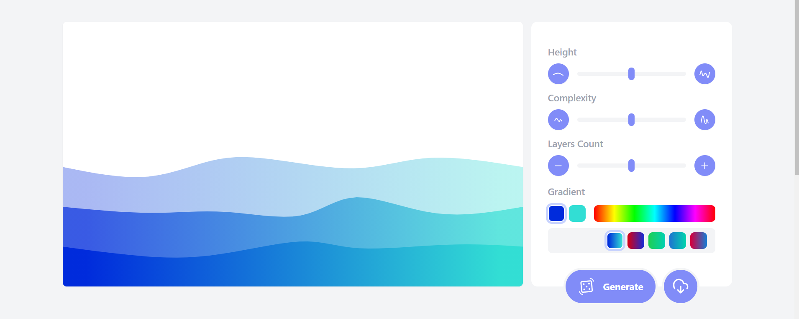
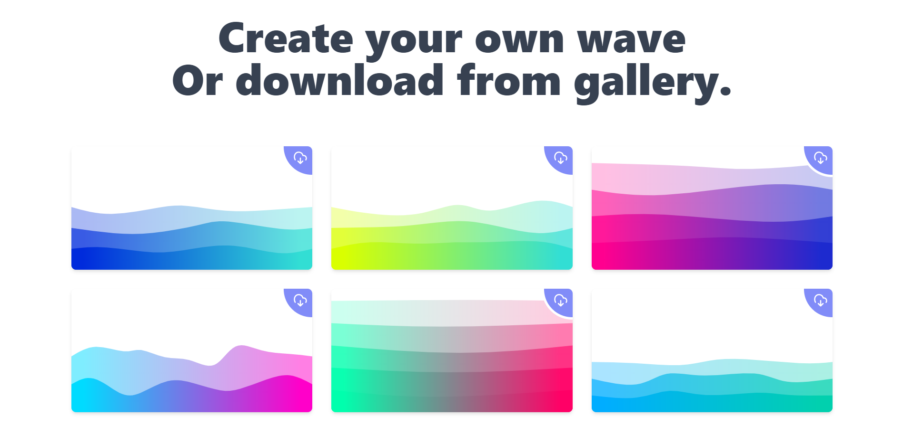

# [Wavify it](https://svg-wave-generator-kphp52lqt-fliseno1k.vercel.app/) - svg wave generator
Gradient svg wave generator with friendly interface that help you create awesome graphics for your website or other project design. 

---

---

## Features

 - Adjust number of layers of waves
 - Modify the number of crest and trough 
 - Change Colors of waves 
 - Export as SVG or PNG 
 - Randomize 

---

 ## App

 **Fell free to create your own wave**

 

**or download from your gallery**

